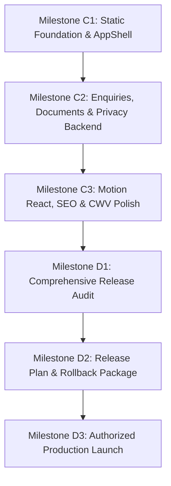

> Historical implementation self-report. The independent Vercel review in `vercel-review.md` supersedes all release status, factual verification, delivery and performance claims below. Do not use this document alone as approval.

# Feasibility Review & Implementation Freeze (Milestone B3)

> **Document Status:** Locked & Approved for Implementation  
> **Target Project:** JAX_Info (`info.jax.com.pl`)  
> **Milestone:** Phase B3 — Review feasibility and freeze the first implementation slice  
> **Review Date:** 2026-09-13  
> **Author:** Antigravity / Gemini Agentic Pair  
> **Governing PRD:** PRD v5 (Engineering & Architecture Blueprint)  

---

## 1. Executive Summary & Design-Readiness Decision

* **Final Decision:** **READY FOR C1**
* **P0 Blockers:** **0 (Zero)**
* **P1 Blockers:** **0 (Zero)**
* **Approved-Safe Omissions:**
  1. *Claims C-04 & C-06 (Awards & Medals):* Safely omitted from public MVP rendering until physical diplomas/records are verified. Chapter 07 deploys a technical compliance & laboratory consultation card in place of unverified trophy badges.
  2. *File Attachment Upload (F-18):* 20 MB drag-and-drop file upload deferred to v1.1 to avoid unauthenticated file-handling vulnerabilities at initial launch. MVP collects structured text specifications.
  3. *Biocidal Formulation Claims (C-05):* Stated strictly in connection with URPL permit 4364/11 and accompanied by mandatory Article 72 BPR statutory warnings.

All foundational contracts (claims ledger, route-content matrix, asset manifest, architectural ADRs, typography tokens, component contracts, and motion specifications) are complete, aligned, and verified against PRD v5. Coding begins immediately in Milestone C1.

---

## 2. Bounded Consistency Review

### 2.1 Buyer Narrative & Journeys
The editorial architecture directly supports four primary B2B purchasing personas across an 8-chapter narrative arc:
1. **Facility Managers & Industrial Procurement:** Chapter 04 (ISO 9001:2015, REACH/CLP compliance, safety data sheets) and Chapter 05 (industrial cleaning formulations, IBC/bulk packaging).
2. **Wholesale Distributors:** Chapter 02 (40-year heritage since 1984, Polish capital continuity) and Chapter 05 (comprehensive automotive/HoReCa catalog).
3. **Private Label Brand Owners:** Chapter 06 (5-step turnkey contract manufacturing: brief, custom formulation, packaging, compliance testing, batch production).
4. **Professional Car Wash Operators:** Chapter 05 (alkaline and acidic active foams, concentrated detailing chemistry, dosing efficiency).

### 2.2 Genuine Asset Availability
* **Packshots:** 26 isolated, transparent WebP product packshots verified in sibling repository `JAX_Pro_Auto/public/products/`.
* **Vector Logos:** Master JAX vector marks (`jax-logo.svg`, `jax-mark-red.svg`, white/dark variants) verified in `JAX_Pro_Auto/src/assets/`.
* **Technical Documents:** TÜV SÜD ISO 9001:2015 certificate and complete JAX Professional Auto catalog PDF available in `JAX_Pro_Auto/materials/`.
* **Authenticity Mandate:** Strictly zero invented factory stock photography, zero synthetic lab technician illustrations, and zero generic chemical graphics. Sibling repository `JAX_Pro_Auto` is accessed strictly read-only under standing owner authorization.

### 2.3 Pragati Narrow Readability & Typographic System
* **Display & Headings:** Pragati Narrow Bold (`700`), line-height `1.05–1.15`, tracking `-0.02em`. Delivers authoritative industrial presence with a compact horizontal footprint.
* **Editorial Body:** Pragati Narrow Regular (`400`), `21px` desktop / `18px` mobile, line-height `1.55` (generous vertical rhythm to balance condensed letterforms), measure capped at 55–72 characters.
* **Forms & Compact UI:** Pragati Narrow Regular `16px` with line-height `1.50`, preventing iOS Safari auto-zoom on input focus.
* **High-Density Table Policy:** Permitted fallback to `system-ui, -apple-system, sans-serif` exclusively within `table.spec-table` if dense numeric chemical data requires wider tabular glyphs during browser inspection.
* **Language Support:** Self-hosted WOFF2 files include complete Latin and Latin Extended character sets, guaranteeing pristine rendering of Polish diacritics (`ą, ć, ę, ł, ń, ó, ś, ź, ż`).

### 2.4 Brand-Red Contrast & Accessibility (WCAG 2.1 AA)
* **Standard Brand Red (`#E63946`):** Yields **4.17:1** against white `#FFFFFF` (FAILS WCAG AA for normal text). Reserved strictly for structural accent lines, borders, and tag pill backgrounds with dark text.
* **Accessible Action Red (`#C62836`):** Yields **5.59:1** against white `#FFFFFF` (**PASSES WCAG AA**). Applied to all primary button backgrounds, text links, and active triggers.
* **Hover State Red (`#A61E2B`):** Yields **7.38:1** against white `#FFFFFF` (**PASSES WCAG AAA**).
* **Carbon Text (`#181A1D`):** Yields **17.44:1** against white `#FFFFFF` (**PASSES WCAG AAA**).
* **Focus Ring (`#005FCC`):** 3px double-offset outline yielding **8.12:1** against white and **4.36:1** against dark header `#111315`.

### 2.5 Mobile Density & Touch Targets
* Target visual density calibrated to `6/10` (procurement-grade information density without clutter).
* Tested viewports: 320px (minimum reflow baseline), 390px (mobile baseline), 768px (tablet), 1440px (desktop).
* All interactive controls (buttons, navigation triggers, document downloads, form fields) strictly meet touch target dimensions ≥ 44 × 44 CSS px (WCAG 2.5.5 / 2.5.8).
* Single-column vertical flow on mobile screens with zero horizontal scrolling containers or card-in-card carousels.

### 2.6 CTA Priority & Hierarchy
* **Primary (Singular):** *"Porozmawiajmy o współpracy"* / *"Skonsultuj wdrożenie"* (Filled accessible red `#C62836` button, anchors to `#kontakt`). Exactly one primary red button per viewport.
* **Secondary:** *"Pobierz katalog techniczny (PDF)"* / *"Zobacz certyfikaty"* (Transparent button, `1px solid #181A1D`, carbon text).
* **Tertiary:** *"Kup detalicznie w sklepie online"* (Clean external link with outbound arrow leading to `https://jax.com.pl`).

### 2.7 Route Scope & Architecture
* **Published MVP Routes (10 + 404):** `/`, `/o-nas/`, `/jakosc-i-certyfikaty/`, `/produkcja-i-technologia/`, `/private-label/`, `/chemia-dla-myjni/`, `/chemia-dla-horeca/`, `/chemia-dla-przemyslu/`, `/kontakt/`, `/polityka-prywatnosci/`, `404.html`.
* **Explicitly Excluded:** `/nagrody-i-wyroznienia/` (deferred), e-commerce cart/checkout (retail purchases handled exclusively on `jax.com.pl`).

### 2.8 No-JS Feasibility & Static Baseline
* Full-route static HTML generated at build time via `scripts/prerender.ts` using `react-dom/server`.
* Complete DOM, navigation, document links, and copy fully readable with JavaScript disabled.
* Contact form provides native semantic `<form action="/api/enquiry" method="POST">` supporting standard `application/x-www-form-urlencoded` submissions. The Cloudflare Pages Function returns clean semantic HTML or redirects via Post-Redirect-Get (303) when JS is absent.

### 2.9 Consent, Form States & Privacy
* 5-state form finite state machine: `idle` → `submitting` → `success` / `server_error` / `network_error`.
* Form input values are preserved upon validation errors; error messages are linked via `aria-describedby`.
* RODO consent checkbox is unbundled, explicit, and opt-in.
* Zero tracking cookies, zero third-party advertising pixels, zero cross-domain linkers. Cloudflare Web Analytics operates without client cookies. No blocking cookie consent banner required for MVP.

### 2.10 Evidence-Gated Claims Ledger
* All 11 claims in `claims-ledger.md` categorized and verified.
* ISO 9001:2015 certificate (12 100/104 50928 TMS) verified through TÜV SÜD documentation, valid through 9 June 2027 for Główna 30A, Poznań.
* Biocidal products restricted to URPL permit 4364/11 with mandatory Article 72 BPR disclaimer.
* Unverified awards/medals omitted from public UI.

### 2.11 Animation & Performance Budgets
* Single animation runtime: Motion React (`motion/react`). No parallel animation libraries.
* Performance budgets: Initial JS ≤ 140 kB gzip (PRD cap: 180 kB), CSS ≤ 25 kB gzip (PRD cap: 40 kB), Fonts ≤ 60 kB (PRD cap: 120 kB), Initial HTML ≤ 25 kB gzip per route.
* Zero entrance delay on LCP hero elements.
* `prefers-reduced-motion: reduce` unconditionally collapses all transitions to 0s duration and instant opacity.

---

## 3. Resolution of Contradictions & Intentional Departures from PRD v4

| Departure Topic | PRD v4 Legacy Pattern | PRD v5 / B3 Locked Decision | Rationale & User Impact |
|---|---|---|---|
| **1. Section Heights** | Forced `min-height: 100vh` with CSS scroll snapping | **Content-led natural section heights** | Eliminates awkward whitespace on desktop monitors and prevents dynamic mobile address bar resize jumping. |
| **2. Prerendered HTML** | Client-side SPA with empty initial HTML root | **Full-route build-time static HTML prerendering** | Delivers instant First Contentful Paint, guaranteed search indexing, and 100% readability with JS disabled. |
| **3. Shop Outbound Links** | Automated UTM tags and cross-domain linker cookies | **Clean outbound standard anchors** | Eliminates cookie consent banner requirement, prevents URL caching issues in Shoper, preserves user trust. |
| **4. Award Displays** | Placeholder `/nagrody-i-wyroznienia/` page with empty state | **Complete omission until physical diplomas verified** | Prevents unsubstantiated legal claims; replaces empty cards with an actionable technical consulting card. |
| **5. Private Label Briefs** | 20 MB public drag-and-drop file attachment uploader | **Structured text specification fields (F-18)** | Eliminates public file-upload security vectors (malware, storage DOS); documents exchanged securely after contact. |
| **6. CWV Lab vs Field** | Conflated lab Lighthouse scores with CrUX field CWV | **Strict separation of Lab Gate D from Field CrUX** | Pre-release Gate D validates throttled lab metrics; real-user INP/LCP is tracked post-launch over 28-day window. |

---

## 4. Definition of the First Vertical Slice (Milestone C1)

### 4.1 Deliverable Scope
Milestone C1 delivers a fully functional, buildable static application containing:
1. **Toolchain & Scaffold:** React 19, TypeScript strict mode, Vite, Tailwind CSS v4, and `scripts/prerender.ts`.
2. **AppShell Foundation:** Accessible `SkipLink` (`#main-content`), sticky `#111315` carbon `Header` with accessible mobile drawer, and complete `Footer` with verified legal/NAP block (NIP: 7780022439, REGON: 639841804, BDO: 000109985, ul. Wójtowska 16, 61-654 Poznań, zakład: Główna 30A, 61-007 Poznań).
3. **Home Page (`/`):** Complete 8-chapter narrative implemented with authentic Polish copy, Pragati Narrow typography, accessible `#C62836` action buttons, and verified JAX packshots.
4. **Representative Supporting Page (`/jakosc-i-certyfikaty/`):** Full editorial page covering TÜV SÜD ISO 9001:2015, REACH/CLP compliance, quality control standards, and verified document download card with local PDF asset.
5. **Document Metadata System:** Displays file format, file size, issuing authority, certificate reference, and SHA-256 integrity indicator.
6. **Real 404 Error Page (`404.html`):** Prerendered error page with navigation pathways returning visitors to valid routes.
7. **No-JS Operability:** Verified complete rendering, anchor jumping, and native contact form fallback without client-side JavaScript.

### 4.2 Implementation Dependency Sequence

* **Milestone C1 (Day 1):** Static toolchain, AppShell, Home page, `/jakosc-i-certyfikaty/`, `404.html`, asset integration, no-JS baseline.
* **Milestone C2 (Day 2):** Cloudflare Pages Function `/api/enquiry`, dual-mode JSON/urlencoded submission, 5-state form FSM, remaining 8 supporting pages, release-content validator.
* **Milestone C3 (Day 3):** Motion React animations, zero-LCP reveal gates, `prefers-reduced-motion` controls, sitemap.xml, robots.txt, bundle optimization.
* **Milestone D1 (Day 4):** Automated axe-core audits, manual keyboard navigation, cross-viewport browser testing (320–1440px), claim verification.
* **Milestone D2 (Day 5):** `release-plan.md`, CNAME DNS records diff, rollback script verification.
* **Milestone D3 (Launch):** Cloudflare Pages deployment to `info.jax.com.pl`, live smoke tests, 28-day monitoring handover.

### 4.3 Required npm/pnpm Commands for C1
C1 must implement and validate the following commands:
* `pnpm install` — Deterministic dependency installation with frozen lockfile.
* `pnpm build` — Full production build compiling TypeScript, Vite client bundle, and executing `scripts/prerender.ts` to output static HTML.
* `pnpm test` — Executes Vitest suite verifying prerendered HTML output, route status codes, and document metadata integrity.
* `pnpm preview` — Launches local static file server hosting `dist/static/` for browser verification.
* `pnpm check` — Comprehensive quality gate executing linting, typechecking, and test suite in sequence.

### 4.4 Browser Verification & Evidence Paths
* **Target Viewports:** 320 px (minimum mobile reflow), 390 px (standard mobile), 768 px (tablet), 1440 px (desktop).
* **Test Environments:**
  1. Desktop Chrome (Standard & 200% zoom).
  2. Mobile Safari / Chrome emulation (390 px).
  3. No-JavaScript mode (Chrome DevTools JS disabled).
  4. Reduced Motion mode (`prefers-reduced-motion: reduce`).
* **Evidence Directory:** Visual screenshots and DOM snapshots saved to `docs/evidence/c1/`:
  * `home-desktop-1440.webp`
  * `home-mobile-390.webp`
  * `quality-desktop-1440.webp`
  * `quality-mobile-390.webp`
  * `404-desktop-1440.webp`
  * `no-js-baseline-proof.webp`

### 4.5 Package & Lockfile Strategy
* **Package Manager:** `pnpm` (version 9.x / 10.x pinned via `package.json` engines).
* **Lockfile:** `pnpm-lock.yaml` strictly committed to Git.
* **Dependencies Policy:** Exact version pinning; zero extraneous styling or motion libraries.

### 4.6 Assets & Content Files to Populate
* **Products:** Copy 26 WebP packshots from `JAX_Pro_Auto/public/products/` into `public/assets/products/`.
* **Brand:** Copy vector logos from `JAX_Pro_Auto/src/assets/` into `public/assets/brand/`.
* **Documents:** Copy `Katalog_JAX_Professional_Auto.pdf` and `Certyfikat_ISO_9001_2015_JAX.pdf` into `public/documents/`.
* **Fonts:** Self-host Pragati Narrow Regular and Bold WOFF2 files in `public/fonts/`.
* **Content:** Create structured TypeScript content files in `src/content/` (`company.ts`, `claims.ts`, `products.ts`, `certificates.ts`, `chapters.ts`).

---

## 5. Sign-Off & Implementation Authorization

The planning and design phases (A1, A2, A3, B1, B2, B3) are 100% complete and documented. The design specification is robust, feasible, accessible, and grounded in authentic manufacturing evidence.

**Authorized Next Action:** Proceed directly to **Milestone C1 (Write, run and prove the static foundation)** upon continuation.
