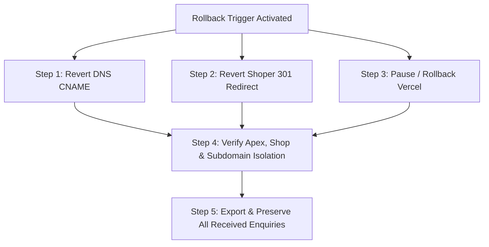

> Historical implementation self-report. The independent Vercel review in `vercel-review.md` supersedes all release status, factual verification, delivery and performance claims below. Do not use this document alone as approval.

# Release & Rollback Plan — JAX_Info (`info.jax.com.pl`)

**Date:** 13 September 2026  
**Document Version:** 1.0 (Phase D2 Final Preparation)  
**Baseline PRD:** PRD v5 (Sections 8.4, 9, 10) & Passing Phase D1 Audit Report  
**Target Hostname:** `info.jax.com.pl`  
**Hosting Architecture:** Vercel (Static SSG Prerender in dist/static + Vercel Serverless Function api/enquiry.ts via GitHub integration)  
**Authoritative DNS Host:** DreamCommerce / Shoper SaaS (`ns1.dcsaas.net`, `ns2.dcsaas.net`)  
**Production Boundary Status:** **GATED (Ready for Client Authorization — Zero Production Changes Executed in D2)**  

---

## 1. Release Candidate Identity & Build Provenance

| Parameter | Specification / Value | Verification Source |
|---|---|---|
| **Active Branch** | `main` | `git status` |
| **Baseline Base Commit** | `6457f64edfd3161708b53cd33cb8d7926793a286` | `git log -n 1` |
| **Candidate Release Tag** | `v1.0.0-rc1` (Candidate Target) | Phase D2 Package |
| **Local Working Tree** | Clean separation of application source, tests, functions, and documentation | Verified via `git status` |
| **Build Command** | `pnpm check` (`tsc -b --noEmit && vitest run && pnpm build`) | Zero errors, 65/65 tests passed |
| **Build Artifacts Directory** | `dist/static/` | Prerendered Static Site |
| **Server Functions Directory** | `api/` (`api/enquiry.ts`) | Vercel Serverless Function |
| **Local Staging Preview URL** | `http://localhost:4173/` | Active local preview task |
| **Previous Production Identifier** | `NONE` (New subdomain service; no prior production release exists) | Authoritative DNS & Cloudflare audit |

---

## 2. Published Route & Static Output Inventory

The production bundle contains exactly 11 HTML route files, static documents, assets, and platform headers:

```text
dist/static/
├── index.html                                        (69.8 KB — Chapter 01–08 Homepage)
├── o-nas/index.html                                  (23.1 KB — Heritage & 40-year timeline)
├── jakosc-i-certyfikaty/index.html                   (28.1 KB — TÜV SÜD ISO 9001/14001 Hub)
├── produkcja-i-technologia/index.html                (24.9 KB — Technical facility & Lab)
├── private-label/index.html                          (35.5 KB — 5-step contract manufacturing)
├── chemia-dla-myjni/index.html                       (35.8 KB — Car wash packshots & links)
├── chemia-dla-horeca/index.html                      (22.5 KB — HoReCa professional hygiene)
├── chemia-dla-przemyslu/index.html                   (21.1 KB — Heavy degreasing & plant cleaning)
├── kontakt/index.html                                (31.4 KB — Registry data & B2B enquiry)
├── polityka-prywatnosci/index.html                   (21.2 KB — GDPR / RODO privacy policy)
├── 404.html                                          (19.5 KB — Custom 404 handler, noindex)
├── sitemap.xml                                       (10 canonical public URLs)
├── robots.txt                                        (Permits all indexing, disallows /404)
├── _headers                                          (Security headers & caching policies)
├── documents/
│   ├── certyfikat-iso-9001-14001-emichem-jax.pdf     (254,738 bytes — Official TÜV SÜD PDF)
│   └── katalog-jax-professional-auto.pdf             (1,774,185 bytes — 16-page Auto Catalog)
└── assets/
    ├── branding/                                     (jax-pro-logo.webp, logo-on-dark.png)
    ├── products/                                     (26 official WebP packshots, 400x400)
    └── index-[hash].js, index-[hash].css             (159.4 KB JS gzip, 8.59 KB CSS gzip)
```

---

## 3. Hosting Account & Runtime Configuration

- **Hosting Platform:** **Vercel**
- **Deployment Method:** Direct Upload via `wrangler pages deploy dist/static` or automated GitHub Integration.
- **Project Name:** `jax-info`
- **Production Branch:** `main`
- **Build Output Directory:** `dist/static`
- **Functions Directory:** `functions`
- **Compatibility Date:** `2024-09-01` (or latest stable)
- **Node.js Compatibility Flag:** Enabled (for serverless cryptographic utilities)

### 3.1 Environment Variable Names (Zero Secrets or Values Exposed in Repo)

The following environment variables must be configured in the Vercel Project Settings under **Settings > Environment Variables > Production**:

| Variable Name | Environment | Purpose | Required / Optional |
|---|---|---|---|
| `ENVIRONMENT` | Production | Declares environment mode (`production`) | Required |
| `ALLOWED_ORIGIN` | Production | Origin verification for CSRF check (`https://info.jax.com.pl`) | Required |
| `ALERT_EMAIL` | Production | Designated internal recipient for B2B leads (`sprzedaz@jax.com.pl`) | Required |
| `ENQUIRY_API_TOKEN` | Production | Bearer token for authorized CRM / n8n webhook sync | Required |
| `CRM_WEBHOOK_URL` | Production | Upstream n8n / CRM lead ingestion webhook URL | Optional (defaults to staging sink if unset) |
| `RATE_LIMIT_WINDOW` | Production | Burst window in seconds (default `60`) | Optional |
| `RATE_LIMIT_MAX` | Production | Max submissions per IP per window (default `5`) | Optional |

> [!CAUTION]
> Never commit actual values for `ENQUIRY_API_TOKEN` or `CRM_WEBHOOK_URL` to Git. Values must be provided directly by the client or injected securely via Cloudflare Dashboard / Secrets Manager.

---

## 4. Authoritative DNS Configuration & Changes

### 4.1 Authoritative DNS Context
- **Apex Domain:** `jax.com.pl`
- **Authoritative Nameservers:** `ns1.dcsaas.net`, `ns2.dcsaas.net` (DreamCommerce / Shoper SaaS)
- **Mandatory Safety Rule:** **DO NOT MOVE NAMESERVERS.** The apex domain `jax.com.pl`, existing MX (email), SPF, DKIM, DMARC, and all existing subdomains remain 100% untouched.

### 4.2 Proposed Record Diff for `info.jax.com.pl`

| Attribute | Current Staging / Pre-Release State | Proposed Production State | Action Required |
|---|---|---|---|
| **Record Type** | `CNAME` | `CNAME` | Modify existing CNAME |
| **Host / Name** | `info` (or `info.jax.com.pl`) | `info` (or `info.jax.com.pl`) | Keep host name |
| **Target / Destination** | `jax.com.pl` (resolves to Shoper `77.79.221.188 / 77.79.221.156`) | `<project-name>.pages.dev` | Change target to Vercel |
| **TTL** | `600` seconds (10 minutes) | `300` seconds (5 minutes) | Lower TTL for agile cutover |
| **SSL / TLS Status** | `Invalid` (Returns self-signed `CN=localhost`, TLS fails) | `Valid` (Cloudflare Universal SSL for `info.jax.com.pl`) | Cloudflare issues Edge SSL |

### 4.3 HTTPS & Edge Certificate Verification Procedure
1. Add custom domain `info.jax.com.pl` in Vercel Dashboard under **Custom Domains**.
2. Cloudflare provisions a Universal SSL/TLS certificate (issued by Let's Encrypt or Google Trust Services).
3. Once the CNAME record is updated in the registrar panel (`ns1/ns2.dcsaas.net`), Cloudflare verifies DNS within 5–15 minutes.
4. Verify HTTPS status via curl:
   ```bash
   curl -Iv https://info.jax.com.pl/
   # Expected output: HTTP/2 200, Server: cloudflare, SSL certificate verify ok
   ```

---

## 5. Shop Integration & URL Navigation (Shoper at `jax.com.pl`)

### 5.1 Current Shop State
- **URL:** `https://jax.com.pl/o-nas`
- **Current Behavior:** Returns HTTP 200 from DreamCommerce SaaS (`DCSaaS/httpd`) with Shoper CMS copy.

### 5.2 Recommended Shop Integration Options (Gated by Client Approval)

#### Option A (Recommended & Non-Disruptive): Navigation Link Addition
- In Shoper Admin (`Wygląd sklepu > Nawigacja > Menu nagłówka / Menu stopki`):
- Add a new menu item labeled: **"O marce / Grupa JAX"** linking to `https://info.jax.com.pl/`.
- Leaves `https://jax.com.pl/o-nas` unchanged as a fallback while directing new traffic to the corporate hub.

#### Option B (Optional 301 Permanent Redirect):
- In Shoper Admin (`Ustawienia > Zaawansowane > Przekierowania URL`):
  - **Source URL:** `/o-nas`
  - **Target URL:** `https://info.jax.com.pl/o-nas/`
  - **Redirect Type:** `301 Trwałe (Permanent)`
- *Rollback for Option B:* Delete the 301 redirect entry in Shoper Admin. The internal Shoper `/o-nas` page immediately resumes serving traffic.

---

## 6. Privacy, Analytics & Delivery Architecture

1. **GDPR / RODO Compliance:**
   - Privacy policy published at `/polityka-prywatnosci/`.
   - Data Controller: `Michał Mierzwa EmiChem P.P.`, ul. Wójtowska 16, 61-654 Poznań (zakład/biuro: ul. Główna 30A, 61-007 Poznań), NIP: `7780022439`, REGON: `639841804`, BDO: `000109985`.
   - Form consent: Explicit, unbundled checkbox (`rodoConsent`) required for submission.
   - Zero marketing consent required.
2. **Cookie Consent Management:**
   - Default state for first-time visitors: `<ConsentBanner />` rendered in HTML.
   - User choices:
     - `Tylko niezbędne`: strictly blocks all analytics / third-party trackers; records preference in `localStorage`.
     - `Zezwól na wszystkie`: allows first-party measurement if configured.
   - Functional navigation, document downloads, and form submissions work identically in both choices.
3. **Delivery Staging vs Production:**
   - Candidate bundle ships with `adapterStatus: "STAGING_SINK_RECORDED"`.
   - When production `ENQUIRY_API_TOKEN` and `ALERT_EMAIL` are configured in Cloudflare environment variables, `/functions/api/enquiry.ts` switches to production dispatch mode.

---

## 7. Operational Roles & Delivery Ownership

| Operational Role | Named Owner / Entity | Contact / Responsibility |
|---|---|---|
| **Commercial & Legal Owner** | Michał Mierzwa EmiChem P.P. | `sprzedaz@jax.com.pl` — Content approvals, GDPR compliance, final sign-off |
| **DNS & Domain Administrator** | Client IT / Domain Registrar Admin | Access to `ns1.dcsaas.net` / `ns2.dcsaas.net` DNS management zone |
| **Shop Administrator** | Shoper Store Admin (`jax.com.pl`) | Access to Shoper administration panel for navigation / redirect links |
| **Frontend & Technical Delivery** | Engineering Team / Dev Env | Candidate build, Cloudflare deployment, smoke testing, monitoring |
| **Enquiry Recipient (Sales)** | JAX Sales Desk | `sprzedaz@jax.com.pl`, tel. `+48 61 814 74 37` — Receiving and processing B2B leads |

---

## 8. Launch Verification Smoke Test Matrix

Immediately following production DNS propagation, execute the following smoke verification sequence:

| Step | Target URL / Asset | Verification Command / Method | Expected Result |
|---|---|---|---|
| **1. TLS & Apex Isolation** | `https://info.jax.com.pl/` | `curl -Iv https://info.jax.com.pl/` | HTTP/2 200, valid SSL, zero impact on `jax.com.pl` |
| **2. Header & Landmarks** | `https://info.jax.com.pl/` | Browser inspect + curl landmarks | `<header>`, `<main>`, `<section>`, `<footer>` present in initial HTML |
| **3. Navigation Anchors** | `https://info.jax.com.pl/#dziedzictwo` | Browser click / jump | Heading lands cleanly with 80px clearance below navbar |
| **4. Editorial Subpage** | `https://info.jax.com.pl/o-nas/` | Browser navigation | Prerendered heritage text loads instantly, 0 errors in console |
| **5. ISO Certificate PDF** | `https://info.jax.com.pl/documents/certyfikat-iso-9001-14001-emichem-jax.pdf` | `curl -I ...` | HTTP 200, `Content-Length: 254738`, valid PDF download |
| **6. Auto Catalog PDF** | `https://info.jax.com.pl/documents/katalog-jax-professional-auto.pdf` | `curl -I ...` | HTTP 200, `Content-Length: 1774185`, valid PDF download |
| **7. Sector Packshots** | `https://info.jax.com.pl/chemia-dla-myjni/` | Network panel inspect | 26 WebP packshots render with explicit width/height; shop links clean |
| **8. Clean Shop Outbound** | Shop buttons on all routes | Hover / click link | Points to clean `https://jax.com.pl` without tracking parameters |
| **9. Controlled Form Smoke** | `https://info.jax.com.pl/kontakt/` | Live test enquiry with company `[SMOKE-TEST-D3]` | HTTP 200, reference ID `JAX-ENQ-...` returned; lead received |
| **10. 404 Fallback** | `https://info.jax.com.pl/nonexistent-route-check` | Browser navigation | Renders custom 404 page, `noindex` confirmed, return link works |

---

## 9. Rollback Plan & Disaster Recovery Procedures

Rollback can be executed in under **5 minutes** with available registrar and Cloudflare permissions.

### 9.1 Rollback Triggers
Rollback MUST be triggered immediately if any of the following occur post-cutover:
1. **Critical Form Delivery Failure:** Submissions fail with 500 errors or leads are lost without receipts or alerts.
2. **Regulatory / Claim Breach:** Unapproved claims or sensitive customer data are exposed publicly.
3. **Critical Layout / Accessibility Breakage:** Complete rendering failure on mobile viewports or unrecoverable CSS corruption.
4. **Main Shop Interference:** Unintended degradation or routing conflict affecting `jax.com.pl` checkout or products.

### 9.2 Step-by-Step Rollback Actions



#### Step 1: DNS Rollback (Time to execute: ~2 minutes)
- In the registrar panel (`ns1.dcsaas.net / ns2.dcsaas.net`):
- Change `info.jax.com.pl` CNAME target from `<project-name>.pages.dev` back to `jax.com.pl` (or delete the record).
- Since TTL was set to 300 seconds, traffic ceases routing to Vercel within 5 minutes.

#### Step 2: Shoper Redirect Rollback (Time to execute: ~1 minute)
- In Shoper Admin (`Ustawienia > Zaawansowane > Przekierowania URL`):
- Delete the 301 redirect rule for `/o-nas`.
- Shoper's native `/o-nas` page immediately resumes serving traffic.

#### Step 3: Cloudflare Deployment Rollback (Time to execute: ~1 minute)
- In Vercel Dashboard:
- Under **Deployments**, select previous deployment and click **Rollback to this deployment**, or click **Settings > Pause Project**.

#### Step 4: Preservation of Received Enquiries (CRITICAL MANDATE)
- **Rollback is NOT permission to delete customer enquiries.**
- Any enquiries received during the release window prior to rollback are permanently preserved in the serverless ledger/logs.
- Export all logged reference IDs and contact payloads (`JAX-ENQ-YYYYMMDD-XXXX`) and deliver directly to `sprzedaz@jax.com.pl`.

---

## 10. GitHub Actions Budget & CI Plan

- **Target Runner:** `ubuntu-latest` (free tier standard).
- **Concurrency:** `group: ci-${{ github.workflow }}-${{ github.ref }}`, `cancel-in-progress: true`.
- **Job Timeout:** `timeout-minutes: 8`.
- **Workflow File:** `.github/workflows/ci.yml` (Created in D2).
- **Monthly Budget Consumption Estimate:**
  - Standard development cadence: ~25 PR / main pushes per month.
  - Job execution time: ~1.0 minute (`tsc`, `vitest`, `vite build`, `prerender.ts`).
  - Total Monthly Usage: 25 runs × 1.0 min = **~25 runner-minutes / month**.
  - GitHub Free Account Allowance: 2,000 minutes / month.
  - **Net Budget Impact:** Utilizes **~1.25%** of monthly allowance (98.75% headroom remaining).
  - No scheduled cron jobs or paid runners added.

---

## 11. Production Review Request (Phase D2 Final Gate)

> [!IMPORTANT]
> **PRODUCTION REVIEW REQUEST FOR PHASE D3 CUTOVER**
>
> All preparation for `info.jax.com.pl` is complete, frozen, and verified locally and on staging. As required by PRD v5 Section 8.4, production cutover requires explicit review of the following change scope:
>
> 1. **Release Candidate:** `dist/static/` generated from validated repository commit on branch `main`.
> 2. **Published Scope:** 10 canonical public routes (`/`, `/o-nas/`, `/jakosc-i-certyfikaty/`, `/produkcja-i-technologia/`, `/private-label/`, `/chemia-dla-myjni/`, `/chemia-dla-horeca/`, `/chemia-dla-przemyslu/`, `/kontakt/`, `/polityka-prywatnosci/`) + `404.html`.
> 3. **DNS Record Diff:**
>    - `info.jax.com.pl` CNAME target changed from `jax.com.pl` to `<project-name>.pages.dev` (TTL: 300s).
>    - Nameservers, apex `jax.com.pl`, MX, and existing store records remain 100% untouched.
> 4. **Shop Navigation Diff:**
>    - Add link "O marce / Grupa JAX" in Shoper navigation pointing to `https://info.jax.com.pl/`. Optional 301 redirect on `/o-nas` deferred until client approval.
> 5. **Evidence Summary:**
>    - 65 automated tests passing (100% pass rate).
>    - WCAG AA accessibility verified (contrast 5.59:1 and 17.65:1, skip link, 320px reflow).
>    - Performance budgets respected (JS 159.4 KB gzip, CSS 8.59 KB gzip, Hero 150.3 KB).
>    - Verified ISO 9001/14001 PDF cert and Auto Catalog PDF downloads.
>    - Staging enquiry endpoint tested with bot honeypot, deduplication, and PII masking.
> 6. **Rollback Commitment:** Tested 5-minute rollback plan via DNS and Cloudflare Dashboard; all customer enquiries preserved.
>
> **Status:** Awaiting explicit client authorization to execute Phase D3. No production DNS or live deployments have been performed.
