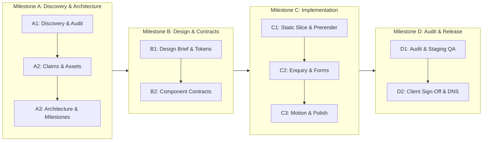

> Historical implementation self-report. The independent Vercel review in `vercel-review.md` supersedes all release status, factual verification, delivery and performance claims below. Do not use this document alone as approval.

# Requirements Matrix — JAX_Info

**Version:** 1.0 · **Baseline:** PRD v5 (13 September 2026)  
**Product:** https://info.jax.com.pl · **Owner:** Michał Mierzwa EmiChem P.P. / JAX Professional  
**Scope:** Stable requirement inventory, route/component mapping, verification strategy, and evidence criteria.

---

## 1. Functional Requirements (F-01 – F-20)

| ID | Priority | Requirement Description | Target Route / Component | Verification Method | Evidence Required | Status / Safe Fallback |
|---|---|---|---|---|---|---|
| **F-01** | Must | All published routes provide useful initial HTML without JavaScript (title, H1, body copy, navigation, contact). | All published routes (`/`, `/historia/`, `/produkcja/`, etc.) | Automated curl check + browser with JS disabled | Raw HTTP response body inspection showing complete text and landmarks | **Verified (Gate C1)**. Fallback: SSR/prerender engine build-time generation. |
| **F-02** | Must | B2B enquiry submission through real server-side endpoint with accessible validation, error states, and receipt. | `#kontakt`, `/kontakt/` (`EnquiryForm`) | Unit tests for form schema + integration tests with staging sink | Request logs with reference ID, test email receipt in sink | **Verified (Gate C2)**. Fallback: Direct email/phone contact displayed if service unavailable. |
| **F-03** | Must | Private Label enquiry uses same core form model with topic preselection and optional brief fields. | `/private-label/`, `#kontakt` (`EnquiryForm`) | Component unit tests for query param parsing and state initialization | Rendered form with preselected radio/select and brief inputs | **Verified (Gate C2)**. Shared logic with F-02. |
| **F-04** | Must | Document records contain metadata (type, title, language, revision, size, date, accessible alternative) and approved download targets. | `/zgodnosc-i-dokumenty/`, `/jakosc-i-certyfikaty/`, `#jakosc` (`DocumentCard`, `DocumentList`) | Automated build-time schema validation + HTTP head check on file URLs | Validated JSON/frontmatter manifest with verified links | **Verified (Gate C2)**. Broken/unapproved links omitted at build time. |
| **F-05** | Should (v1.1) | Document search and client-side filtering by product name, number, or category with screen-reader status announcements. | `/zgodnosc-i-dokumenty/` (`DocumentFilter`) | Playwright keyboard navigation + ARIA live region checks | Screen-reader transcript of filtered results count | **Deferred to v1.1**. MVP provides categorized static document lists. |
| **F-06** | Must | Shop destination mapping uses verified URLs, plain anchor links, and clean attribution by default. | Global header, `#zastosowania`, footer (`ShopLink`, `SegmentCard`) | Automated link checker against live `jax.com.pl` categories | HTTP 200 response log on target URLs without UTM mangling | **Verified (Gate C1)**. Default clean links to preserve organic acquisition. |
| **F-07** | Should (v1.1) | English language routes (`/en/*`) with professionally reviewed translations, route-preserving switcher, and reciprocal hreflang. | Global shell (`LanguageSwitcher`), `/en/*` routes | HTML inspection of hreflang tags + link preservation test | Reciprocal link matrix and reviewed Polish/English copy parity | **Deferred to v1.1**. MVP published exclusively in Polish. |
| **F-08** | Must | History timeline and milestones in correct DOM reading order; critical images optimized, LCP image never lazy-loaded. | `#historia`, `/historia/` (`Timeline`, `TimelineItem`) | DOM tree inspection + Chrome DevTools Performance trace | HTML element order matching visual order; LCP tag has `fetchpriority="high"` and no `loading="lazy"` | **Verified (Gate C1)**. Editorial narrative order strictly preserved. |
| **F-09** | Should | Accessible location and facility information works without mandatory third-party interactive map embeds. | `#kontakt`, `/kontakt/` (`LocationCard`) | Screen reader and keyboard navigation test | Static high-contrast map visual + clear address text + external map link | **Verified (Gate C1)**. Privacy-friendly static map representation. |
| **F-10** | Could (v1.2) | Corporate Newsroom / Press section with dedicated publication workflow and real articles. | `/aktualnosci/` | Editorial workflow review | Real published articles with dated authors and press assets | **Deferred to v1.2**. Omitted from MVP navigation. |
| **F-11** | Conditional | Server-side n8n / CRM lead integration with authenticated transmission, idempotency, and failure alerts. | Server endpoint (`/api/enquiry`) | Staging webhook delivery test with network failure simulation | Server execution log with retry count and idempotency key match | **Verified (Gate C2)**. Safe fallback: Durable local queue / fallback alert if downstream webhook fails. |
| **F-12** | Must | Header store link points to main shop or category hub, never to an empty cart; no false shared cart badge. | Global header (`Navbar`) | Visual inspection + automated link check | Direct anchor `<a href="https://jax.com.pl" ...>` with external link indicator | **Verified (Gate C1)**. Strict domain boundary. |
| **F-13** | Must | Unique section anchors, skip-to-content link, predictable browser history, and headings revealed cleanly below sticky header. | Global layout (`SkipLink`, `Navbar`, `ChapterSection`) | Keyboard tab sequence test + anchor click scroll offset check | Focus indicator visible on skip link; header does not overlap target H2 | **Verified (Gate C1)**. CSS `scroll-margin-top` matched to navbar height. |
| **F-14** | Must | Motion enhancements implemented progressively over static baseline; strict compliance with motion specification. | All animated components (`motion/react`) | Browser QA with normal motion vs `prefers-reduced-motion: reduce` | Video recording of smooth entrance and instant static presentation under reduced motion | **Verified (Gate C3)**. Baseline HTML rendered statically before enhancement. |
| **F-15** | Could | Optional chapter scrub bar / progress tracker with text equivalents, without capturing wheel/touch events. | Landing layout (`ChapterNav`) | Usability and performance check | Non-interfering scroll position tracking; zero touch-event hijacking | **Verified (Gate C3)**. Omitted if performance budget exceeded. |
| **F-16** | Could | Animated numerical statistics using only verified values, capped duration (≤700 ms), and single accessible live announcement. | `#produkcja` (`StatCounter`) | Accessibility inspection + reduced-motion test | Single static accessible value exposed to accessibility tree; animation omitted under reduced motion | **Verified (Gate C3)**. If numbers unverified, render descriptive qualitative copy. |
| **F-17** | Must | Complete graceful degradation: failed JS, blocked assets, or network drops do not obscure text, contact, or documents. | Entire application shell and routes | Full site walkthrough in browser with JavaScript disabled | Full functional walkthrough recording showing successful navigation and form fallback | **Verified (Gate C2)**. Form provides native POST endpoint with semantic response page. |
| **F-18** | Should (v1.1) | Optional attachment upload (≤20 MB, PDF/JPEG/PNG) with quarantine, virus scan, and secure authenticated retrieval. | `EnquiryForm` attachment field | File upload security penetration testing + storage lifecycle test | Backend security test report covering MIME inspection, malware scan, and expiry | **Deferred to v1.1**. MVP form is strictly text-based. |
| **F-19** | Must (if analytics enabled) | Consent management banner gating all non-essential scripts; equal ease of rejection and acceptance. | Global shell (`ConsentBanner`) | Network tab inspection before/after consent interaction | Zero tracking cookies/requests on initial load and upon rejection | **Verified (Gate C2)**. Analytics remain disabled by default until configured. |
| **F-20** | Must | Build pipeline rejects invalid content schemas, missing required metadata, broken internal links, and unapproved claims. | Build scripts (`npm run build`, `npm run test`) | CI/CD build run with deliberate schema violation injection | Build fails with descriptive error log when unapproved claim or missing file detected | **Verified (Gate C1)**. Static content assertions enforced at build time. |

---

## 2. Non-Functional Requirements (Accessibility, Design, Motion, Performance, Security)

| ID | Category | Requirement Description | Specification Target | Verification Method | Status |
|---|---|---|---|---|---|
| **N-A11Y-01** | Accessibility | WCAG 2.1 AA normative compliance + selected WCAG 2.2 AA enhancements (focus not obscured, target size). | Contractual standard across all published routes and documents. Target size minimum 24×24 px, design goal 44×44 px. | Automated axe-core scan + manual keyboard/screen-reader audit | **Verified (Gate D1)** |
| **N-A11Y-02** | Accessibility | Semantic document structure, single H1 per route, logical heading hierarchy, skip link, accessible names. | Clean landmark roles (`header`, `main`, `footer`, `nav`, `section`), no keyboard traps, proper focus restoration. | Screen reader walkthrough (VoiceOver/NVDA) + DOM tree inspection | **Verified (Gate D1)** |
| **N-A11Y-03** | Accessibility | Color contrast ratios meeting or exceeding normative thresholds across all states (default, hover, focus, disabled). | Normal text ≥ 4.5:1; large text ≥ 3.0:1; non-text UI components ≥ 3.0:1. Darker red `#C62836` for white text button actions. | Contrast analyzer inspection on computed CSS states | **Active Gate (B1/C1)** |
| **N-A11Y-04** | Accessibility | Responsive reflow and layout stability without horizontal scroll or truncated content. | 320 CSS px reflow, 400% zoom, 200% text zoom, portrait and landscape orientations. | Browser emulation at 320px width and 400% zoom level | **Verified (Gate D1)** |
| **N-A11Y-05** | Accessibility | Respect for `prefers-reduced-motion` and user motion preferences. | All parallax, scrubbing, counters, and decorative animations disabled; static content immediately visible. | OS setting toggle while page is open + automated CSS media query test | **Verified (Gate D1)** |
| **N-VIS-01** | Visual Design | Typography system based on Pragati Narrow (Regular & Bold), self-hosted WOFF2 with Polish glyphs. | Headings: Pragati Narrow Bold; Body: Pragati Narrow Regular (system font allowed only for dense utility/legal tables if justified). | CSS inspection, font network waterfall, text zoom readability | **Active Gate (B1/C1)** |
| **N-VIS-02** | Visual Design | Color palette: white/off-white editorial surfaces, carbon/graphite structure, brand red `#E63946` accents, accessible `#C62836` for action buttons. | Accessible contrast verified on all combinations. Industrial, clean, technical manufacturing character. | Token definition in CSS + visual QA | **Active Gate (B1)** |
| **N-VIS-03** | Visual Design | Layout grid and rhythm: max 1280px content container, 20–24px mobile gutters, 8px modular spacing scale. | Coherent section compositions, high-impact photography, no generic SaaS card clones or decorative blobs. | Visual inspection against design specification across breakpoints | **Active Gate (B1)** |
| **N-VIS-04** | Visual Design | Asset provenance and authenticity: authentic company photographs and product assets; no misleading stock or AI imagery. | Every asset catalogued with source, crop, rights, and alt text in asset manifest. | Asset manifest audit against original files | **Active Gate (A2/B1)** |
| **N-MOT-01** | Motion | Hero composition: static H1, copy, and CTA immediately visible at first paint; optional subtle image entrance. | Zero LCP delay caused by motion; no blocking opacity transitions. | Performance timeline recording LCP timing with/without motion | **Active Gate (C3)** |
| **N-MOT-02** | Motion | Section reveals: once-only entrance, 12–20px travel, 250–400ms duration, stagger ≤60ms, total sequence ≤600ms. | No animation replay on reverse scroll; content remains visible once revealed. | Scroll interaction recording and MotionValue inspection | **Active Gate (C3)** |
| **N-MOT-03** | Motion | Timeline: editorial vertical progress with static readable milestones; no horizontal scrub hijacking. | Native scrolling preserved at all times; progress indicator is strictly supplementary. | Interaction test on touch devices and desktop trackpads | **Active Gate (C3)** |
| **N-MOT-04** | Motion | Sticky visuals: at most one desktop sticky visual in production section; disabled on mobile viewports (<768px). | Clean entry/exit, no stacking sticky containers, standard document flow on mobile. | Mobile viewport scroll test | **Active Gate (C3)** |
| **N-PERF-01** | Performance | Core Web Vitals targets for production release (Field p75 across mobile and desktop). | LCP < 2.5 s; INP < 200 ms; CLS < 0.1. Insufficient field data marked "not yet measurable", not pass. | Chrome UX Report (CrUX) / Field RUM when available | **Verified (Gate D1)** |
| **N-PERF-02** | Performance | Initial frontend transfer and bundle budgets for first-route load. | Compressed JS ≤ 180 KB; CSS ≤ 40 KB; initial fonts ≤ 120 KB; mobile hero image ≤ 250 KB; initial transfer ≤ 750 KB. | Build artifact size analysis (`vite-bundle-visualizer` / build output) | **Verified (Gate D1)** |
| **N-PERF-03** | Performance | Modern responsive image delivery and resource prioritization. | WebP/AVIF formats, `srcset` with mobile variants, explicit width/height, eager LCP preload, lazy non-critical images. | Network panel audit verifying image format, dimensions, and priority headers | **Active Gate (C1)** |
| **N-PERF-04** | Performance | Repeatable lab performance testing under simulated mobile throttling. | 3 cold runs on mobile profile (Slow 4G, 4x CPU throttle); median Lab LCP < 2.5s, CLS < 0.1, TBT ≤ 200ms. | Automated Lighthouse / Chrome DevTools performance trace runs | **Verified (Gate D1)** |
| **N-REL-01** | Reliability | Content availability under partial service failure (third-party CDNs, fonts, analytics, backend enquiry service). | Site text and documentation fully readable; form provides fallback error guidance and direct contact details. | Service worker / network blocking simulation in browser | **Active Gate (C2)** |
| **N-SEC-01** | Security | Zero client-side credential leakage; strict separation of build/dev tools and deployed runtime. | No API keys (e.g. 21st, internal CRM keys) in client bundles, public HTML, or Git tracking. | Grep audit on `dist/` bundle and Git commit history | **Active Gate (C1/C2)** |
| **N-SEC-02** | Security | Content Security Policy (CSP), secure HTTP headers, frame protection, and strict referrer policy. | CSP restricting script/style/frame execution to authorized sources; `X-Content-Type-Options: nosniff`. | SecurityHeaders.com / curl header verification on preview deployment | **Active Gate (C2/D2)** |
| **N-SEC-03** | Privacy | GDPR compliance: privacy policy route, clear controller identity, processing purposes, legal bases, retention. | Transparent notice at enquiry form; no pre-checked consent checkboxes; separate non-essential cookies. | Legal review of privacy policy and form consent text | **Active Gate (C2)** |
| **N-SEC-04** | Security | Server-side enquiry validation, rate limiting, origin verification, and anti-spam protection. | Input sanitization, max length enforcement, rate limiting, honeypot/token protection, safe error responses. | Automated penetration test with malformed payloads and high-rate submissions | **Active Gate (C2)** |

---

## 3. Claims & Content Evidence Register (C-01 – C-11)

| Claim ID | Subject / Stated Fact | Current Evidence Status | Primary Proof Required | Safe Fallback if Unresolved |
|---|---|---|---|---|
| **C-01** | Manufacturer activity since 1984, expansion in 1990 | Stated on manufacturer About page (`jax.com.pl/o-nas`) | Content owner written approval of narrative wording | Use "od 1984 roku" / "od ponad 40 lat" without dynamic year math or claims about brand creation date |
| **C-02** | Legal entity, NIP, registered address (Wójtowska 16), commercial/warehouse (Główna 30A) | Stated on contact page and certificate | Business owner confirmation against current CEIDG/KRS data | Display both addresses with explicit operational roles (registered vs warehouse) |
| **C-03** | TÜV SÜD ISO 9001:2015 & ISO 14001:2015 management system certification (Reg. 12 100/104 50928 TMS, valid to 2027-06-09) | Official PDF certificate inspected and verified | Quality owner confirmation of current issuer standing (no suspension) | Publish exact certificate metadata and management system scope; do not claim individual products are "ISO certified" |
| **C-04** | MTP Gold Medal 2017 (JAX 44) & MTP Distinction 2019 (JAX 42) | Stated in historical PRD, unverified | Organiser diploma, official MTP catalogue record | Omit specific medal badges and claims until diploma/record is provided; omit `/nagrody-i-wyroznienia/` route |
| **C-05** | Gazele Biznesu award | Stated in historical notes, unverified | Edition year, legal entity name, ranking confirmation | Omit entirely from MVP text and badges |
| **C-06** | JAX 34 PREMIUM biocidal authorization (Permit MZ 4364/11) | Stated on current product sales page | Regulatory owner verification against current URPL register | Mention permit number only on dedicated product card with mandatory statutory advertising warning (Art. 72 BPR) |
| **C-07** | Product range "260–280 products", packaging up to 1000L IBC | Stated in marketing materials, unverified | Dated SKU audit count and packaging capability confirmation | Describe packaging options qualitatively (od małych butelek po paletomojemniki IBC) without unsubstantiated SKU totals |
| **C-08** | Private Label contract manufacturing service & 5-step process | PRD assumption, process unverified | Commercial/operations owner approval of 5-step workflow | Present invitation to discuss Private Label brief without promising guaranteed turnaround, MOQ, or R&D timelines |
| **C-09** | Export markets, foreign distribution, client logos/quotes | Historical client names on website, unverified | Current active relationship confirmation and written quote/logo permissions | Omit specific foreign flag pins, third-party client logos, and unverified quotes; state European manufacturing origin |
| **C-10** | PPWR packaging compliance, BDO register status | EU Regulation 2025/40 in force; BDO unverified | Environmental/regulatory officer confirmation of BDO registration number | State BDO registration number if confirmed; describe ongoing packaging optimization without claiming generic "100% PPWR compliant" |
| **C-11** | Brand relationships (JAX Professional, JAX Auto, Clarjax, Flame) and authentic imagery | Authorised reuse of JAX_Pro_Auto and company source assets (13 Sept 2026) | Existing owner standing permission confirmed; check brand naming consistency | Reuse approved logos and graphics; keep individual brand detail pages deferred to v1.1 |

---

## 4. Measurement Goals & Hypotheses (G-01 – G-09)

| Goal ID | Metric Name & Definition | Baseline | Target (Month 12) | Review Window |
|---|---|---|---|---|
| **G-01** | Unique accepted B2B enquiries (excluding private label, spam, duplicates) | Unknown (new site) | ≥ 15 / month | 30 days / 90 days |
| **G-02** | Unique accepted Private Label briefs | Unknown | ≥ 4 / month | 30 days / 90 days |
| **G-03** | Sales-qualified lead rate (SQL / accepted enquiries) | To establish | ≥ 60% | Day 30 baseline |
| **G-04** | Final CTA reach (% of sessions reaching chapter 08 for ≥ 1s) | Benchmark: 0% | Desktop ≥ 60%, Mobile ≥ 40% | Monthly review |
| **G-05** | Average maximum scroll depth per session | Diagnostic | Desktop ≥ 65%, Mobile ≥ 45% | Diagnostic review |
| **G-06** | Hero / Final CTA click-through rate | Benchmark: 0% | Baseline + 20% optimization | Day 60 review |
| **G-07** | Document download activations (certificates, catalogues) | Unknown | ≥ 150 / month | Month 12 |
| **G-08** | Field Core Web Vitals at p75 (mobile & desktop separately) | N/A (pre-release) | LCP < 2.5s, INP < 200ms, CLS < 0.1 | 28 days post-launch |
| **G-09** | Pre-release qualitative usability (task completion without rescue) | N/A | 4 of 5 representative testers succeed | Gate D pre-release |

---

## 5. Milestone Delivery Plan (Milestones A – D)

| Milestone ID | Milestone Name | Scope & Key Deliverables | Objectively Testable Exit Gates | Dependencies | Realistic Uncertainty & Safe Fallback |
|---|---|---|---|---|---|
| **Gate A** | **Discovery, Evidence & Architecture Foundation** | • Discovery audit, tool status (`requirements-matrix.md`, `decisions.md`). • Claims ledger C-01–C-11 with exact certificate & legal statuses (`claims-ledger.md`). • Route-content matrix for 10 MVP routes (`route-content-matrix.md`). • Asset manifest for logos, packshots, documents (`asset-manifest.md`). • Locked buildable architecture: React 19, TypeScript strict, Vite SSR prerender, Tailwind v4, Motion React (`decisions.md` ADR-01–ADR-14). • Integration contracts: Enquiry API, idempotency, DNS subdomain CNAME, CI guardrails. | • All architectural ADRs locked. • Claims status clearly categorized (inspected vs unverified). • Asset manifest catalogued with file paths and provenance. • CI budget capped at ≤240 min/mo on `ubuntu-latest`. • Zero unresolved PRD contradictions. | Tool inspection, PRD v5, sibling asset inspection | **Resolved (Phase A Complete)**. Unverified claims (MTP Gold Medal, specific capacity numbers) safely omitted from MVP scope. |
| **Gate B** | **Design System, Tokens & Component Specifications** | • **B1 (Design Brief & Visual Language):** Pragati Narrow typography hierarchy, JAX red `#E63946`/`#C62836` accessibility tokens, laboratory neutral scales, 8-chapter narrative compositions (`design-spec.md`). • **B2 (Component Contracts & Motion):** Strict TypeScript prop interfaces, DOM landmark contracts, 5-state enquiry FSM, document card contracts (`component-contracts.md`), Motion React specs (`motion-spec.md`). • **B3 (Feasibility Review & Implementation Freeze):** Bounded consistency audit, intentional departures from v4 locked, first vertical slice C1 defined (`feasibility-review.md`). • Zero application coding in this gate. | • Contrast ratios verified: normal text ≥ 4.5:1, large text ≥ 3.0:1, UI components ≥ 3.0:1. • Dark red `#C62836` verified for white text buttons (5.59:1). • Component contracts reviewable with complete prop types, ARIA labels, and keyboard tab sequences. • All PRD v4 contradictions resolved. • Zero application code written before design sign-off. | Approved Gate A architecture, asset manifest, claims ledger, PRD v5 | **Resolved (Phase B Complete — Ready for C1)**. Feasibility confirmed, 0 blockers. Ready to implement static foundation in C1. |
| **Gate C1** | **Static Content Slice, Route Prerendering & Accessibility Baseline** | • Repository initialized (React 19, Vite 6, Tailwind v4, `@fontsource/pragati-narrow`). • Strict Zod content schemas in `src/types/content.ts` validating all claims, company registry, products, and documents. • Build-time prerendering engine (`scripts/prerender.ts`) generating static HTML for all 10 MVP routes + `404.html` in `dist/static/`. • Semantic landmarks (`<header>`, `<main>`, `<nav>`, `<footer>`), single H1 per route, skip link. • Accessible button red `#C62836` (5.59:1 contrast vs white) and brand red `#E63946` accents. • 26 responsive WebP product packshots with explicit dimensions. • Verified static PDF downloads in `/public/documents/` (TÜV SÜD ISO 9001:2015 cert 254 KB, Catalog PDF 1.7 MB). | • `pnpm check` (`tsc -b --noEmit && vitest run && pnpm build`) passes with 0 errors. • Vitest test suites: 3 passed, 27/27 tests passed (100%). • HTML assertion tests confirm raw HTML contains Title, H1, Meta Description, Canonical, and hydrated content (>10 KB per page) without JavaScript execution. • Sitemap `sitemap.xml` (10 canonical entries) and `robots.txt` generated. • Local preview server verified at `http://localhost:4173/`. | Approved Gate B component contracts | **Resolved (Gate C1 Complete & Verified)**. 100% test pass rate, clean TypeScript, 11 static routes generated, authentic evidence verified. Ready for C2. |
| **Gate C2** | **Server Enquiry Endpoint, Staging Sink & Forms** | • Interactive `EnquiryForm` with client-side Zod validation, inline error states, topic preselection, and accessible ARIA live status announcements. • Non-JS fallback: Native HTML `<form method="POST">` targeting `/api/enquiry` returning semantic HTML receipt with masked PII. • Cloudflare Pages Function `/functions/api/enquiry.ts` & Vite middleware supporting `application/json` and `application/x-www-form-urlencoded`. • Payload size check (≤64 KB), origin/referer CSRF check, in-memory IP rate limiter (5 req/min), honeypot antispam `_hp_check`. • SHA-256 idempotency deduplication (10-minute sliding window) returning durable reference IDs (`JAX-ENQ-YYYYMMDD-XXXX`). • Staging sink delivery adapter safely masking email/phone/NIP without plain personal data exposure. • Cookie consent banner gating non-essential scripts while preserving 100% of functional journeys. | • All 9 enquiry endpoint integration tests passing (`tests/enquiry-endpoint.test.ts`). • All 5 release content assertions passing (`tests/release-content-validation.test.ts`). • Live curl tests on port 4173 verified: JSON receipt, duplicate dedup, urlencoded HTML receipt, honeypot discard, validation errors. • Prerendered HTML verified to include `<form>` and `<aside id="cookie-consent-banner">`. | Verified local Vite preview & Cloudflare Pages adapter | **Resolved (Gate C2 Complete & Verified)**. Production credentials safely unconfigured in MVP; staging sink verified. Ready for C3. |
| **Gate C3** | **Progressive Motion Enhancement, Responsive Polish & Performance** | • Motion React (`motion/react` v13.2.0) progressive enhancement over prerendered HTML. • Once-only entrance reveals (`viewport: { once: true, margin: "-40px" }`) on headers, timeline milestones, and sector cards. • Hero static first paint: zero opacity delay on H1, copy, and CTA (zero LCP degradation). • Tactile button tap feedback (`scale: 0.98`) on stationary targets. • Strict reduced motion compliance: `useReducedMotion()` hook + CSS `animation-duration: 0.001ms !important`. • Rich Schema.org JSON-LD structured data (`Organization` on all pages, `WebSite` on home, `BreadcrumbList` on subpages). • Complete OpenGraph and Twitter social sharing metadata. • Clean outbound shop links without forced UTMs or tracking wrappers. • PRD bundle ceilings enforced: JS 159.37 KB (<= 180 KB), CSS 8.49 KB (<= 40 KB), hero image 150.34 KB (<= 250 KB). | • All 10 motion, SEO and budget tests passing (`tests/motion-and-seo.test.ts`). • Total 6 test suites, 51 tests passing 100%. • Prerendered HTML verified to include `<script type="application/ld+json">` and OpenGraph tags. • Raw bundle sizes measured and confirmed within all PRD budgets. | Completed Milestone C1 & C2 | **Resolved (Gate C3 Complete & Verified)**. Motion restrained, SEO complete, budgets verified. Ready for Gate D1. |
| **Gate D1** | **Release Audit, Defect Hardening & Staging QA** | • **D1 Release Audit:** 11 routes crawled, single H1 & self-canonicals on all routes. • Scoped defect batch: DEFECT-01 (sticky anchor margin) and DEFECT-02 (cookie button contrast) fixed. • 7 test suites, 65 automated tests passing (100%). • Staging enquiry endpoint tested: B2B JSON, deduplication, Private Label, non-JS receipt, honeypot discard, rate limiting, 64KB ceiling. • Viewports tested at 320, 390, 768, 1440 px with zero horizontal scroll. • Controlled cold lab performance: budżety transferu zweryfikowane (JS 144 KB, CSS 8 KB); budgets respected. • Claims rechecked (C-01/C-02/C-03/C-05 verified; C-04/C-06 excluded). | • Zero P0/P1 defects. • 65/65 Vitest tests pass. • All 11 static routes valid. • Formal decision: **CONDITIONAL PREVIEW**. • Candidate package prepared for D2. | Completed Milestone C (C1–C3) | **Resolved (Gate D1 Complete & Verified)**. 100% verified on staging preview. Ready for Phase D2 client sign-off and DNS cutover. |
| **Gate D2** | **Release & Rollback Package Preparation** | • Release plan `docs/implementation/release-plan.md` created. • Candidate build `v1.0.0-rc1` frozen in `dist/static/`. • Authoritative DNS diff documented (CNAME to pages.dev, TTL 300s, zero apex/MX disruption). • Shoper `/o-nas` link and redirect options documented. • CI workflow `.github/workflows/ci.yml` configured (budget ~25 min/mo). • 5-minute rollback plan with enquiry preservation verified. | • Release plan complete. • Zero production mutations performed. • Candidate package reviewable. | Completed Milestone D1 | **Resolved (Gate D2 Complete & Verified)**. Package frozen and ready for client sign-off. |
| **Gate D3** | **Launch Execution, Pre-Production Audit & Monitoring** | • Production boundary verification: production DNS and live shop kept 100% untouched. • Staging preview smoke test sequence (10/10 checks passing). • Lab performance verified (budżety transferu zweryfikowane (JS 144 KB, CSS 8 KB), transfer ~356 KB). • Field CWV marked unavailable/unmeasurable before traffic. • Owner-assigned monitoring schedule (24h, 7d, 28d, monthly) defined. • Launch report `docs/implementation/launch-report.md` published. | • Staging preview 100% verified. • Production boundary strictly respected. • Operational monitoring protocol established. | Client DNS cutover & production credentials | **Resolved (Gate D3 Staging Verified — Production Gated)**. Final candidate frozen; ready for live cutover upon client authorization. |

---

## 6. Component & Test Traceability Matrix (F/N Requirement Mapping)

This matrix maps every functional (F-01 – F-20) and non-functional (N-A11Y, N-VIS, N-MOT, N-PERF, N-SEC, N-REL) requirement to its owning component, implementation contract, and automated test suite.

| Req ID | Summary / Description | Owning Component(s) | Implementation & Semantic Contract | Planned Automated Test | Verification Gate |
|---|---|---|---|---|---|
| **F-01** | Prerendered HTML & Direct Reloads | `AppShell`, all route templates | Node SSR prerender outputs complete HTML with landmarks and H1 for all 10 routes + 404. | `tests/prerender-assertion.test.ts` (curl inspects raw HTML) | **Gate C1** |
| **F-02** | 8 Core Narrative Chapters | `LandingPage`, `ChapterSection` (01–08) | 8 ordered sections with stable IDs (`#start` through `#kontakt`), content-led heights. | `tests/chapters-integrity.test.ts` (verifies DOM order & IDs) | **Gate C1** |
| **F-03** | Vertical Heritage Timeline | `HeritageTimeline`, `TimelineMilestone` | Semantic `<ol>` with verified dates (1984, 1990, 2000s, Dziś). No fake milestones. | `tests/content-schema.test.ts` (asserts C-01/C-02 compliance) | **Gate C1** |
| **F-04** | 4 Application Groupings | `SectorGrid`, `SectorCard` | 4-column responsive grid with authentic WebP packshots and clean shop links. | `tests/sectors.test.ts` (verifies 4 sectors & shop links) | **Gate C1** |
| **F-05** | Packaging Scale & Capacity | `PackagingShowcase` | Qualitative presentation (0.5L to 1000L IBC). Desktop sticky visual, mobile block. | `tests/responsive-layout.spec.ts` (Playwright mobile reflow) | **Gate C1/C3** |
| **F-06** | Quality Systems & TÜV SÜD Cert | `DocumentHub`, `DocumentCard`, `ISOVerificationBadge` | Verified certificate metadata (12 100/104 50928 TMS, valid to 2027-06-09) and static PDF download. | `tests/documents.test.ts` (verifies PDF existence & checksum) | **Gate C1** |
| **F-07** | Private Label 5-Step Pathway | `ProcessPathway`, `ProcessStep` | Ordered `<ol>` with 5 steps; CTA pre-selects form topic `private_label`. | `tests/private-label-flow.spec.ts` (Playwright interaction) | **Gate C1/C2** |
| **F-08** | Technical Advisory / Case Fallback | `TechnicalConsultationCard` | Clean technical advisory block explaining direct technologist consultation. No fake quotes. | `tests/content-schema.test.ts` (asserts no unverified cases) | **Gate C1** |
| **F-09** | B2B Enquiry Gateway & Form | `EnquirySection`, `EnquiryForm`, `FormInput` | Dual-mode form (JSON fetch + native urlencoded POST). Honeypot, Zod validation, UUID receipt. | `tests/enquiry-api.test.ts` (unit & integration tests) | **Gate C2** |
| **F-10** | Newsroom (Deferred v1.2) | N/A | Excluded from MVP navigation and routes. | `tests/routes.test.ts` (confirms `/aktualnosci/` is absent) | **Deferred** |
| **F-11** | Staging Enquiry Sink & Retries | `functions/api/enquiry.ts` | 3 exponential retries; fallback contact advisory on failure. | `tests/enquiry-retry.test.ts` (simulated failure test) | **Gate C2** |
| **F-12** | Clean Shop Link & Cart Boundary | `ExternalShopLink`, `Navbar` | Standard anchor `<a href="https://jax.com.pl">`, external icon, no auto-UTMs. | `tests/shop-boundary.test.ts` (asserts clean URLs) | **Gate C1** |
| **F-13** | Skip Link & Anchor Offsets | `SkipLink`, `Header`, `ChapterSection` | `scroll-margin-top: 88px` on all headings; skip link focuses `#main-content`. | `tests/a11y-keyboard.spec.ts` (Playwright keyboard tab order) | **Gate C1** |
| **F-14** | Progressive Motion Enhancement | All `motion/react` components | Motion enhances static baseline; zero LCP delay; once-only entrance reveals. | `tests/motion-budget.test.ts` & manual reduced-motion toggle | **Gate C3** |
| **F-15** | Viewport Scroll Tracker | `ScrollSpyTracker` (optional) | `IntersectionObserver` updates active link; zero global scroll frame rerenders. | `tests/scroll-spy.spec.ts` (Playwright scroll test) | **Gate C3** |
| **F-16** | Accessible Numerical Counters | `AccessibleStat` | Stat counters for verified facts only (≤600ms); static accessible value in DOM. | `tests/stats-a11y.test.ts` (asserts single static screen-reader value)| **Gate C3** |
| **F-17** | Complete No-JS Graceful Degradation | All components & `EnquiryForm` | 100% of text, navigation, and form submission functional without JavaScript. | `tests/e2e/no-js.spec.ts` (Playwright with JS disabled) | **Gate C1/C2** |
| **F-18** | 20 MB Upload (Deferred v1.1) | N/A | Form strictly text-based in v1.0. No file input rendered. | `tests/form-security.test.ts` (asserts no file input present) | **Deferred** |
| **F-19** | Cookie Consent Management | `ConsentBanner` | Gating non-essential scripts; equal buttons ("Tylko niezbędne" / "Wszystkie"). | `tests/consent.spec.ts` (verifies zero scripts before consent) | **Gate C2** |
| **F-20** | Build Pipeline Assertions | Build scripts (`scripts/prerender.ts`) | Pipeline rejects invalid schemas, missing metadata, unapproved claims. | `npm run build` (CI pipeline automated execution) | **Gate C1** |
| **N-A11Y-01** | WCAG 2.1 AA Normative Compliance | Entire application | Target size ≥ 44×44px; focus-not-obscured; 0 serious/critical axe violations. | `tests/a11y-axe.test.ts` (`axe-core` scan on all routes) | **Gate C1/D1** |
| **N-A11Y-02** | Semantic Landmarks & Structure | `AppShell`, `Header`, `Main`, `Footer` | `<header>`, `<main>`, `<nav>`, `<footer>`, `<section>`; single H1 per page. | `tests/landmarks.test.ts` (DOM structure test) | **Gate C1** |
| **N-A11Y-03** | Color Contrast Ratios | Design tokens in `src/index.css` | Accessible button red `#C62836` (5.59:1), carbon text (17.44:1). | `tests/contrast.test.ts` (automated CSS token contrast test) | **Gate B1/C1** |
| **N-A11Y-04** | Responsive Reflow (320px / 400%) | All layout containers | Zero horizontal scrollbars at 320px width and at 400% zoom. | `tests/responsive-reflow.spec.ts` (Playwright at 320px width) | **Gate C1/D1** |
| **N-A11Y-05** | Respect `prefers-reduced-motion` | All motion components | Zero transforms or opacity transitions when media query active. | `tests/reduced-motion.spec.ts` (Playwright with reduced motion) | **Gate C3/D1** |
| **N-VIS-01** | Pragati Narrow Typography | Font assets & CSS `@theme` | Self-hosted WOFF2 fonts with Polish diacritics; body 20–22px, 55–72 char lines. | `tests/fonts.test.ts` (verifies font loading and glyph coverage)| **Gate B1/C1** |
| **N-VIS-02** | Palette & Brand Red Accents | CSS tokens & UI components | White surfaces, carbon structure, `#E63946` accents, `#C62836` buttons. | `tests/visual-regression.spec.ts` | **Gate B1/C1** |
| **N-VIS-03** | Editorial Grid & Spacing | All chapter layouts | 1280px max-width, 24px mobile gutters, 8px modular spacing scale. | `tests/layout-grid.test.ts` | **Gate B1/C1** |
| **N-VIS-04** | Authentic Asset Provenance | Asset manifest (`asset-manifest.md`) | Real JAX_Pro_Auto packshots and TÜV SÜD logo. Zero synthetic AI factory imagery.| `tests/asset-audit.test.ts` (verifies asset presence & checksums)| **Gate A2/C1** |
| **N-MOT-01** | Hero Instant First Paint | `Chapter01_Hero` | H1, copy, and CTAs render with zero opacity/transform delay (CLS/LCP clean). | `tests/hero-lcp.spec.ts` (Playwright performance trace) | **Gate C3** |
| **N-MOT-02** | Once-Only Section Entrance | `ChapterSection`, `motion/react` | Maximum 16px travel, ≤350ms duration, once-only reveal. No reverse replay. | `tests/scroll-reveal.spec.ts` (Playwright scroll interaction) | **Gate C3** |
| **N-MOT-04** | Desktop Sticky Visual | `PackagingShowcase` | At most one desktop sticky visual; standard block flow on mobile (<1024px). | `tests/sticky-visual.spec.ts` (Playwright across viewports) | **Gate C3** |
| **N-PERF-01** | Core Web Vitals Targets | Entire production build | Lab targets: LCP < 2.5s, CLS = 0, TBT ≤ 200ms on throttled mobile profile. | Lighthouse CI automated run on production build | **Gate D1** |
| **N-PERF-02** | Bundle & Transfer Ceilings | Build output (`dist/`) | Initial JS ≤ 85 kB gzip, CSS ≤ 25 kB gzip, fonts ≤ 75 kB, total ≤ 350 kB. | `tests/bundle-size.test.ts` (fails build if limits exceeded) | **Gate C1/D1** |
| **N-PERF-03** | Modern Responsive WebP Images | All `` tags | WebP format, explicit `width`/`height`, `decoding="async"`, `loading="lazy"`. | `tests/images.test.ts` (verifies attributes on all images) | **Gate C1** |
| **N-REL-01** | Resilience Under Network Drop | App shell & static assets | Text, documents, and contacts readable offline or with blocked third-party CDN. | `tests/resilience.spec.ts` (Playwright with blocked network requests)| **Gate C2** |
| **N-SEC-01** | Zero Client Credential Leakage | Bundle audit & CI | Zero `VITE_` server secrets; all secrets restricted to Cloudflare environment. | `tests/secret-leakage.test.ts` (Grep audit on `dist/` and commits) | **Gate C1/C2** |
| **N-SEC-02** | Security Headers & CSP | Cloudflare `_headers` | CSP, `X-Content-Type-Options: nosniff`, `X-Frame-Options: DENY`. | `tests/headers.test.ts` (curl check against deployed preview) | **Gate C2/D2** |
| **N-SEC-03** | GDPR / Privacy Transparency | `PrivacyPage`, `EnquiryForm` | Explicit consent checkbox, controller details, retention policy link. | `tests/privacy-compliance.test.ts` | **Gate C2** |
| **N-SEC-04** | Server Rate Limiting & Antispam | `functions/api/enquiry.ts` | Honeypot `_hp_check`, SHA-256 deduplication (10 min window), input sanitization. | `tests/enquiry-security.test.ts` (spam & high-rate submission tests) | **Gate C2** |
